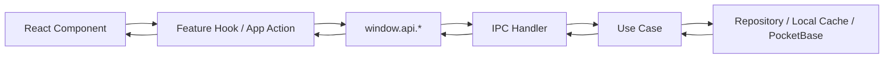

# Xinjuben Target Architecture

## 1. Architecture Positioning

This project is best shaped as a `desktop shell + modular monolith`.

- `Electron main` owns window lifecycle, OS integration, logging, local persistence, and backend connectivity.
- `preload` is the only bridge between trusted desktop capabilities and the web UI.
- `renderer` is a pure React app responsible for presentation, interaction, and local workflow state.
- `shared` holds cross-process contracts, pure domain types, and business rules that do not depend on Electron or React.

This is the right balance for the current size of the project:

- not too heavy like microservices or over-engineered DDD
- much clearer than the current "UI directly reaches service and global store" shape
- easy to evolve into a multi-window desktop product later

## 2. Current Problems

The current codebase already has the correct top-level folders: `main / preload / renderer`.
The issue is that the runtime boundaries are not fully respected yet.

### Current architectural issues

1. `renderer` directly owns PocketBase access.
2. `service` code mutates Zustand UI state on failure.
3. `preload` exists, but it does not expose a typed business API yet.
4. stage navigation exists visually, but feature modules are not actually mounted.
5. the project currently fails typecheck because of a JSX string syntax error.

### Why this matters

- the UI is too close to infrastructure
- testing will become painful as features grow
- auth, sync, offline cache, and error handling will spread everywhere
- Electron security boundaries are underused

## 3. Target Design Principles

### Principle 1: Keep dependency direction one-way

Allowed direction:

`renderer UI -> renderer app layer -> preload API -> main application -> infrastructure`

Not allowed:

- infrastructure directly mutating renderer stores
- React components importing backend SDK clients
- main process importing renderer state logic

### Principle 2: Separate three kinds of state

- `UI state`: panels, loading flags, dialogs, error banners
- `workflow state`: current project, current stage, draft content, dirty markers
- `remote state`: auth session, synced records, save result, server timestamps

Do not mix all three into one Zustand store.

### Principle 3: Business rules stay pure

Engines like `FactEngine` and `DramaEngine` should be pure functions.

They should not:

- call PocketBase
- touch Zustand
- know about Electron

That makes them reusable in renderer previews and main-process validation.

### Principle 4: Electron capabilities are accessed only through typed contracts

The renderer should never depend on raw Electron globals.
It should call stable APIs such as:

- `window.api.auth.signIn(...)`
- `window.api.workspace.load(...)`
- `window.api.outline.saveDraft(...)`
- `window.api.system.getAppInfo()`

## 4. Proposed Directory Structure

```text
src/
  shared/
    contracts/
      auth.ts
      project.ts
      workflow.ts
      outline.ts
      character.ts
      script.ts
      ipc.ts
    domain/
      user.ts
      project.ts
      workflowStage.ts
      outline/
        types.ts
        factEngine.ts
      script/
        types.ts
        dramaEngine.ts
    lib/
      result.ts
      errors.ts
      guards.ts

  main/
    app/
      bootstrap.ts
      createMainWindow.ts
      registerIpc.ts
    application/
      auth/
        signIn.ts
        signOut.ts
        restoreSession.ts
      workspace/
        loadWorkspace.ts
        changeStage.ts
      outline/
        loadOutlineDraft.ts
        saveOutlineDraft.ts
      character/
        loadCharacterDraft.ts
        saveCharacterDraft.ts
      script/
        loadScriptDraft.ts
        saveScriptDraft.ts
    infrastructure/
      backend/
        pocketbase/
          client.ts
          authRepository.ts
          projectRepository.ts
          workflowRepository.ts
      storage/
        draftCache.ts
        settingsStore.ts
      logging/
        logger.ts
    ipc/
      authHandlers.ts
      workspaceHandlers.ts
      outlineHandlers.ts
      characterHandlers.ts
      scriptHandlers.ts
      systemHandlers.ts
    index.ts

  preload/
    api/
      auth.ts
      workspace.ts
      outline.ts
      character.ts
      script.ts
      system.ts
    index.ts
    index.d.ts

  renderer/
    src/
      app/
        App.tsx
        providers/
          AppBootstrap.tsx
        routes/
        store/
          useSessionStore.ts
          useShellStore.ts
          useWorkflowStore.ts
      pages/
        LoginPage.tsx
        WorkspacePage.tsx
      widgets/
        AppShell/
          AppShell.tsx
          Sidebar.tsx
          Topbar.tsx
      features/
        auth/
          api.ts
          hooks/
          ui/
        workspace/
          api.ts
          hooks/
          ui/
        outline/
          api.ts
          model/
            selectors.ts
            mappers.ts
          hooks/
            useOutlineEditor.ts
          ui/
            OutlineStage.tsx
            OutlineFactsPanel.tsx
        character/
          api.ts
          hooks/
          ui/
        detailedOutline/
          api.ts
          hooks/
          ui/
        script/
          api.ts
          hooks/
          ui/
      shared/
        ui/
          ErrorBoundary.tsx
          WorkspaceInput.tsx
          ValidationBadge.tsx
        lib/
          format.ts
          stageLabel.ts
        assets/
      main.tsx
```

## 5. Layer Responsibilities

## 5.1 `src/shared`

This layer is the language spoken by the whole app.

- `contracts`: request and response types shared across `main`, `preload`, and `renderer`
- `domain`: pure business entities and validation engines
- `lib`: `Result`, app errors, type guards, helpers

Rules:

- no React
- no Electron
- no PocketBase SDK

## 5.2 `src/main`

This is the application backend inside the desktop app.

Responsibilities:

- create the window
- register IPC handlers
- own backend and local storage clients
- orchestrate use cases
- enforce input validation before side effects

### Recommended sublayers in `main`

- `app`: composition root
- `application`: use cases
- `infrastructure`: SDK clients, filesystem, logs
- `ipc`: thin transport adapters

The `main` process should own PocketBase access if you want a clean desktop boundary.

Important note:
If future features require truly privileged secrets, those secrets should live in a real backend service, not in Electron main.

## 5.3 `src/preload`

This layer should expose a minimal, typed, versioned API.

Example shape:

```ts
interface AppApi {
  auth: {
    signIn(input: SignInInput): Promise<AuthSessionDto>
    signOut(): Promise<void>
    restoreSession(): Promise<AuthSessionDto | null>
  }
  workspace: {
    load(projectId: string): Promise<WorkspaceSnapshotDto>
    changeStage(stage: WorkflowStage): Promise<void>
  }
  outline: {
    load(projectId: string): Promise<OutlineDraftDto>
    save(projectId: string, draft: OutlineDraftDto): Promise<SaveDraftResultDto>
  }
  system: {
    getAppInfo(): Promise<AppInfoDto>
  }
}
```

`preload` should do only one job:
translate `ipcRenderer.invoke(...)` into a stable browser-safe API.

## 5.4 `src/renderer`

This is the real frontend application.

Responsibilities:

- route/page composition
- stage switching
- form editing
- optimistic UI
- local validation display
- user feedback

Not allowed:

- importing PocketBase SDK directly
- importing `electron` directly
- storing backend transport details in components

## 6. Recommended Runtime Flow



### Example: save outline draft

1. `OutlineStage` changes local draft state.
2. `useOutlineEditor` triggers `saveDraft`.
3. `renderer/features/outline/api.ts` calls `window.api.outline.save(...)`.
4. `preload` forwards to `ipcRenderer.invoke('outline:save', payload)`.
5. `main/ipc/outlineHandlers.ts` validates the payload.
6. `application/saveOutlineDraft.ts` coordinates save logic.
7. repository writes to local cache first, then PocketBase.
8. result returns to renderer.
9. `useWorkflowStore` updates `dirty`, `saving`, `lastSyncedAt`.

## 7. State Model

Use Zustand, but use it intentionally.

### Store split

#### `useSessionStore`

Owns:

- current user
- auth status
- startup restore state

#### `useShellStore`

Owns:

- sidebar collapse
- modal visibility
- global error banner
- network/offline indicator
- degraded mode UI state

#### `useWorkflowStore`

Owns:

- current project id
- current stage
- save status
- dirty flags per module
- sync timestamps

#### Feature-local stores or reducers

Use local state or feature stores for form editing:

- outline draft
- character draft
- script scene list

Do not put everything in one global store.

### Key rule

`main` and repositories return data and errors.
Only the renderer decides how that affects banners, dialogs, or degraded mode.

## 8. Feature Module Design

Each workflow stage should become a real module, not just a visual tab.

### Modules

- `outline`
- `character`
- `detailedOutline`
- `script`
- `workspace`
- `auth`

### What each module owns

- its DTO mapping
- its editor hook
- its UI
- feature-specific selectors
- stage save/load actions

### What each module does not own

- window creation
- auth bootstrap
- backend SDK construction
- cross-feature shell layout

## 9. Contracts and Naming

### IPC channel naming

Use explicit verb-oriented channels:

- `auth:sign-in`
- `auth:sign-out`
- `session:restore`
- `workspace:load`
- `workspace:change-stage`
- `outline:load`
- `outline:save`
- `character:load`
- `character:save`
- `script:load`
- `script:save`
- `system:get-app-info`

### DTO naming

- `SignInInput`
- `AuthSessionDto`
- `WorkspaceSnapshotDto`
- `OutlineDraftDto`
- `SaveDraftResultDto`

Keep DTOs in `src/shared/contracts`.

## 10. Error Handling Strategy

Introduce a standard app error model.

```ts
type AppErrorCode =
  | 'AUTH_REQUIRED'
  | 'VALIDATION_FAILED'
  | 'NETWORK_ERROR'
  | 'SAVE_CONFLICT'
  | 'UNEXPECTED'
```

Recommended shape:

```ts
interface AppError {
  code: AppErrorCode
  message: string
  recoverable: boolean
  details?: unknown
}
```

Rules:

- `main` maps SDK and IO errors into `AppError`
- `renderer` maps `AppError` into toast, banner, retry button, or fallback screen
- domain engines return validation results, not thrown infrastructure errors

## 11. Security Baseline

For Electron, this should be the baseline:

- `contextIsolation: true`
- `nodeIntegration: false`
- `sandbox: true` if your dependencies allow it
- expose only typed preload APIs
- validate IPC input in main
- whitelist external URLs before `shell.openExternal`
- keep raw backend client creation outside renderer

## 12. PocketBase Placement

### Recommended now

Put PocketBase behind `main -> application -> infrastructure`.

Benefits:

- renderer no longer imports the SDK
- auth and save flows become testable
- error handling becomes centralized
- future local cache and retry logic have a natural home

### Recommended later

If the product grows into collaboration, billing, or truly privileged logic:

- move privileged business logic to a real backend service
- keep Electron main as desktop adapter, not as permanent secret vault

## 13. Page and Shell Composition

Use this top-level composition:

```text
App
  AppBootstrap
    LoginPage or WorkspacePage
      AppShell
        Sidebar
        Topbar
        StageContent
          OutlineStage | CharacterStage | DetailedOutlineStage | ScriptStage
```

`App.tsx` should stop rendering placeholder content for all stages.
It should act as the composition root for:

- bootstrapping
- auth gating
- shell layout
- stage component mounting

## 14. Refactor Roadmap

### Phase 0: Stabilize the project

- fix the JSX syntax error in `OutlineStage.tsx`
- make `typecheck` and `build` pass
- actually mount real stage components from `App.tsx`

### Phase 1: Establish contracts

- create `src/shared/contracts`
- define preload API types
- replace `window.electron` usage with `window.api`

### Phase 2: Pull infrastructure out of renderer

- move PocketBase client creation into `main/infrastructure`
- add IPC handlers and preload adapters
- make renderer call feature APIs instead of SDKs

### Phase 3: Split stores and features

- create `useSessionStore`, `useShellStore`, `useWorkflowStore`
- move stage logic into `features/*`
- keep shared UI primitives under `renderer/shared/ui`

### Phase 4: Resilience and productization

- add local draft cache
- add retry and conflict handling
- add sync status indicators
- add telemetry and structured logs

## 15. Concrete First Iteration

If we start refactoring today, the first safe landing should be:

1. fix compile errors
2. mount `OutlineStage`
3. create `src/shared/contracts/workflow.ts`
4. expose `window.api.workspace` and `window.api.outline`
5. move PocketBase code out of `renderer/services/pocketbase.ts`
6. split the current `useAppStore` into shell and workflow concerns

This gives immediate value without a risky rewrite.

## 16. Final Recommendation

The best target for this project is:

- `shared` for contracts and pure business rules
- `main` for orchestration and side effects
- `preload` for typed transport
- `renderer` for UI and workflow interaction
- feature modules per writing stage
- separate stores for session, shell, and workflow

That gives you a structure that is:

- secure enough for Electron best practice
- maintainable as stage complexity grows
- easy to test
- ready for offline draft caching and future sync
